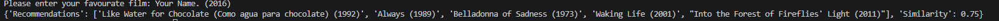

# 🎬 Movie Recommender System

> A lightweight, content-based movie recommendation engine utilizing Jaccard Similarity.

## 💡 Project Overview
This project implements a movie recommendation system using Python and Pandas. By processing structured datasets and calculating the Jaccard similarity between movie genres, the engine successfully identifies overlapping attributes to generate personalized, top-5 movie recommendations.

This project bridges technical implementation with strategic business value. In a real-world commercial context, highly accurate recommendation algorithms are critical for driving user retention, increasing platform engagement, and ultimately supporting data-driven business growth.

## 🛠️ Tech Stack
* **Core Language:** Python 3.x
* **Data Processing:** Pandas
* **Algorithm:** Jaccard Similarity (Intersection over Union)

## 🚀 Quick Start

### 1. Clone the Repository
\`\`\`bash
git clone https://github.com/your-username/your-repo-name.git
cd your-repo-name
\`\`\`

### 2. Install Dependencies
This project relies on `pandas` for data manipulation and matrix operations. 
\`\`\`bash
pip install -r requirements.txt
\`\`\`

### 3. Run the Application
\`\`\`bash
python movie_recommendation_system.py
\`\`\`

## 📊 Usage Example

\`\`\`text
Please enter your favorite film: Inception

--- Recommendations ---
Target Film: Inception
Recommendations: ['The Matrix', 'Interstellar', 'Blade Runner 2049', 'Minority Report', 'Arrival']
Similarity: 0.8571
\`\`\`

## 🔜 Future Roadmap
* [ ] **Feature Expansion:** Integrate additional features such as directors and cast, exploring TF-IDF or Cosine Similarity for enhanced precision.
* [ ] **Web UI Deployment:** Build and deploy an interactive web interface.
* [ ] **Performance Optimization:** Explore alternative matrix operations for improved scalability on larger datasets.

## 🤝 Contributing & Feedback
Pull requests and issues are welcome! If you find this project helpful or interesting, please consider giving it a ⭐ Star.